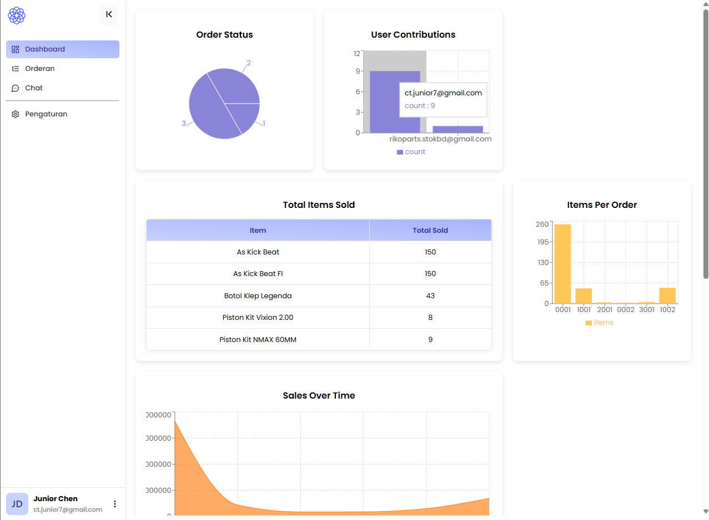
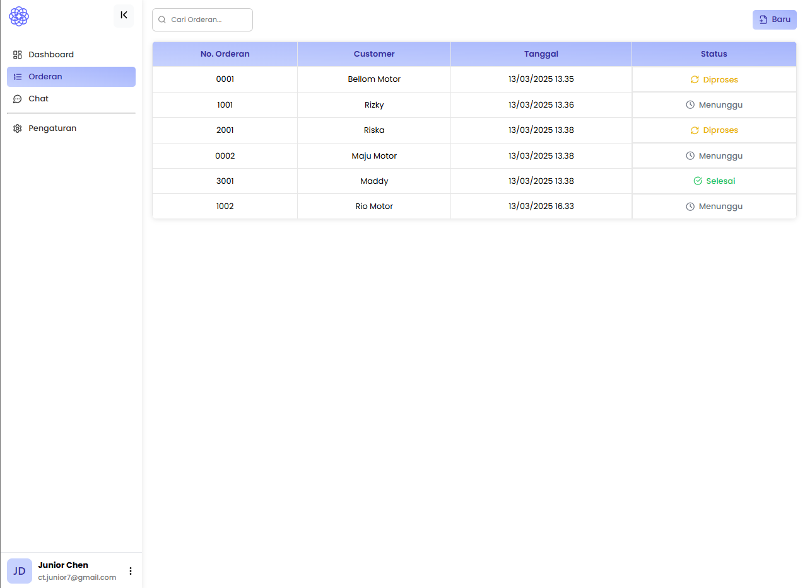
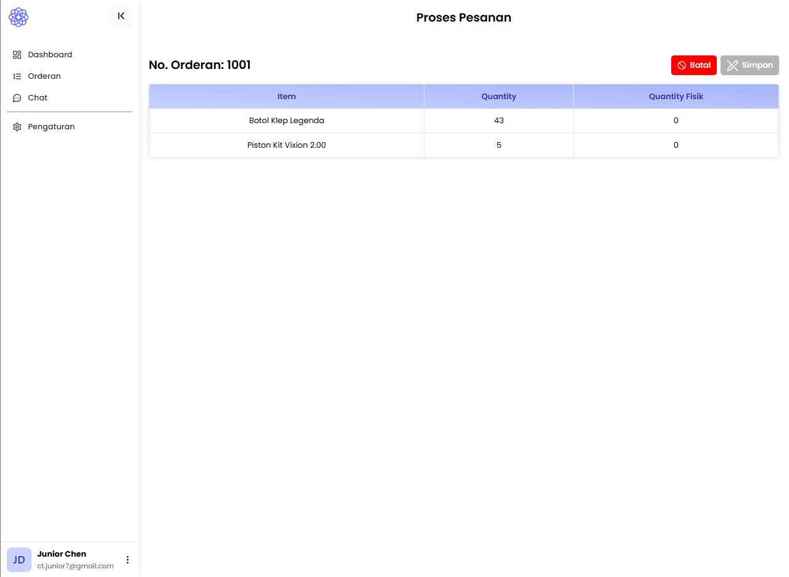

# 📦 System Logistic - Web Orders System

<p align="left">
  
  
  
  
  
</p>

Sistem manajemen pesanan logistik terintegrasi yang dirancang khusus untuk operasional **Logistic**. Aplikasi ini mempermudah pengelolaan data pesanan, pemantauan stok, dan komunikasi antar divisi secara real-time.

---

## 🛠️ Tech Stack

**Frontend:**
- **Framework:** React.js (Vite)
- **Styling:** CSS Modern & Responsive Design
- **State Management:** React Context API
- **Real-time:** Firebase SDK

**Backend:**
- **Runtime:** Node.js & Express
- **Admin SDK:** Firebase Admin (untuk manajemen data tingkat lanjut & notifikasi)
- **Notifications:** Firebase Cloud Messaging (FCM)

---

## 🔍 Fitur Utama & Dokumentasi

### 1. Dashboard Operasional
Ringkasan data logistik yang memberikan informasi cepat mengenai status pesanan saat ini.
<p align="center">
  
</p>

### 2. Manajemen Pesanan
Sistem pelacakan pesanan yang transparan dengan fitur pencarian dan filter status yang akurat.
<p align="center">
  
</p>

### 3. Pengolahan Data & Integrasi Barcode
Halaman pengisian item pesanan telah disiapkan untuk mendukung efisiensi input data melalui perangkat barcode scanner.

<p align="center">
  
</p>

> [!NOTE]  
> **Informasi Barcode:** UI pada gambar di atas (`order_process`) sudah dirancang untuk menerima input barcode guna menambah kuantitas (*qty*) item secara otomatis. Namun, logika pemrosesan otomatis saat ini dinonaktifkan (disimpan untuk pengembangan tahap selanjutnya) dikarenakan keterbatasan akses ke fisik barcode selama periode pengembangan ini.


## ⚙️ Persiapan & Instalasi

### Struktur Folder Penting
Agar sistem dapat terhubung dengan database, Anda wajib memperhatikan konfigurasi Firebase berikut:

1. **Letakkan file kredensial:** Simpan file `serviceAccountKey.json` Anda di direktori:
   `backend/firebase/serviceAccountKey.json`
2. **Keamanan:** Folder ini sudah otomatis diabaikan oleh Git melalui file `.gitignore` di folder backend untuk mencegah kebocoran kunci akses administrator ke repositori publik.
3. **Fungsi:** Penempatan file ini di sisi backend memastikan bahwa koneksi ke database hanya dilakukan melalui server yang aman (Server-Side), sehingga kredensial Anda tidak terekspos di browser pengguna.

### Langkah Menjalankan Aplikasi

**Backend:**
```bash
cd backend
npm install
npm start
